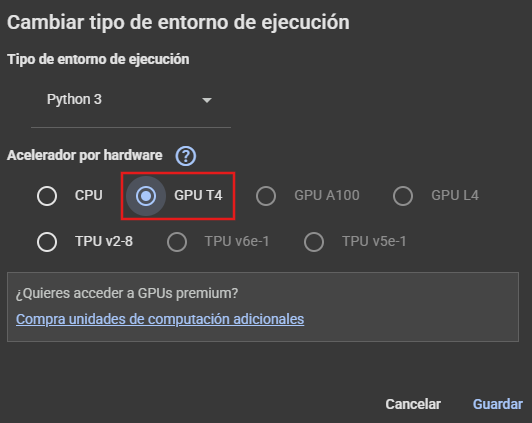

# Código

## Árbol de carpetas

```text
│   README.md
│
├───cholesky
│       cholesky.c
│       cholesky.py
│       cholesky_paralelo.c
│       cholesky_paralelo.py
│
├───cuda_implementaciones
│       inversion_manual_impl.ipynb
│       matrix_inversión_cuda.ipynb
│
├───gaussiana
│       gaussiana.c
│       gaussiana.py
│       parallel_gaussiana.c
│       parallel_gaussiana.py
│
├───lu
│       lu_matrix_inversion.c
│       lu_matrix_inversion.py
│       parallel_lu_matrix_inversion.c
│       parallel_lu_matrix_inversion.py
│
└───resultados
        resultados_cholesky.ipynb
        resultados_gaussiano.ipynb
        resultados_lu.ipynb
```


Como se puede observar en el árbol de carpetas del repositorio el código principal está dividido en las carpetas de los algoritmos realizados. Por ejemplo, en la carpeta `lu` se encuentran alojados 4 archivos. La inversión de matrices de manera secuencial con el lenguaje C, la inversión de matrices de manera secuencial con el lenguaje Python, y otros 2 archivos con la implementación paralelizada del algoritmo. 

Tambien podemos ver una carpeta llama `cuda_implementaciones` la cual tiene dos archivos, uno de ellos con la implementación de los algoritmos de manera manual usando unidades de procesamiento grafico y la otra tiene con la inversión de matrices usando los paquetes de `linalg.inv` de Pytorch y Cupy

## Compilación y ejecución

### Restricciones para la generación de matrices:
- Para los algoritmos `lu` y `gaussiana` las matrices que se deben usar deben cumplir con ser cuadradas e invertibles.
- Para el algoritmo `cholesky` se deben tener en cuenta las recomendaciones anteriores y adicionalmente, deben ser definidas positivas. (estas matrices también están cargadas en el repositorio en la carpeta proyectos_2025-1/virtual/GR-06/matrices/def_pos_inv)

Las matrices a usar se encuentran todas en este repositorio también en la carpeta proyectos_2025-1/virtual/GR-06/matrices

Se pueden cargar estas matrices en formato `.csv` o generar nuevas matrices de diferentes tamaños para probar la eficiencia de los algoritmos. 

### Python
Para los algoritmos de Python (todos implementados en un archivo .py) se debe tener Python3 instalado y si no se tiene instalado numpy es recomendable crear un entorno virtual en la carpeta code con los siguientes comandos:

```bash
python3 -m venv venv
source venv/bin/activate
pip install numpy
```

Luego, para ejecutar por ejemplo el algoritmo lu paralelo en python se navega hasta la carpeta `lu` y se ejecuta el siguiente comando:
```bash
python3 parallel_lu_matrix_inversion.py 100
```

Cambiando 100 por la dimensión de la matriz que se quiere invertir

> [!TIP]
> Para todos los algoritmos implementados en Python se hace el mismo proceso. Se navega hasta la carpeta del algoritmo y se ejecuta el archivo `.py` pasándole las dimensiones de la matriz.

### C
Para los algoritmos en C, necesitamos compilar cada uno de diferente manera dependiendo las necesidades de cada archivo.

- [lu_matrix_inversion.c](lu/lu_matrix_inversion.c): `gcc -O2 -o lu lu_matrix_inversion.c`
- [parallel_lu_matrix_inversion.c](lu/parallel_lu_matrix_inversion.c): `gcc -O2 -o parallel_lu parallel_lu_matrix_inversion.c -lpthread`
- [gaussiana.c](gaussiana/gaussiana.c): `gcc -O2 -o gaussiana gaussiana.c -lm`
- [parallel_gaussiana](gaussiana/parallel_gaussiana.c): `gcc -O2 -o parallel_gaussiana parallel_gaussiana.c -lpthread -lm`
- [cholesky.c](cholesky/cholesky.c): `gcc -O2 -o cholesky cholesky.c -lm`
- [cholesky_paralelo.c](cholesky/cholesky_paralelo.c): `gcc -O2 -fopenmp -o cholesky_paralelo cholesky_paralelo.c -lm`

Para ejecutarlos, se escribe: `./{ejecutable} {N}` siendo:

- **ejectuable:** El nombre del ejecutable de cada algoritmo.
- **N:** Las dimensiones de la matriz que se quiere invertir. 

Por ejemplo:
```bash
./gaussiana 500
```

Representa cuando queremos usar el algoritmo de reducción gaussiana para inversión y queremos invertir la matriz 500x500

### CUDA
Para los notebooks con las implementaciones se recomienda trabajar en Google Colab [Carpeta Drive](https://drive.google.com/drive/folders/1YM4oo6Az1tYHnOZyW4jSi4aTgQAjvqPb?usp=drive_link) alli encontraran 2 archivos los cuales tienen acceso directo al Colab. 
Una vez se tenga el documento abierto:

Cambiar el entorno de ejecución a GPU
Ve a la barra superior y haz clic en:
"Entorno de ejecución" → "Cambiar tipo de entorno de ejecución"

En la ventana emergente:

Tipo de hardware acelerador: selecciona GPU

(Deja los otros campos como están)

Haz clic en "Guardar"

Imagen de referencia:




Luego se pueden ejecutar todas las celdas disponibles, entre ellas puedes usar una particular que te permite confirmar si puedes trabajar con CUDA:
```
import torch
torch.cuda.is_available()
``` 
Si todo esta en orden y se hizo de manera correcta, la ejecución de la celda retorna `True`  